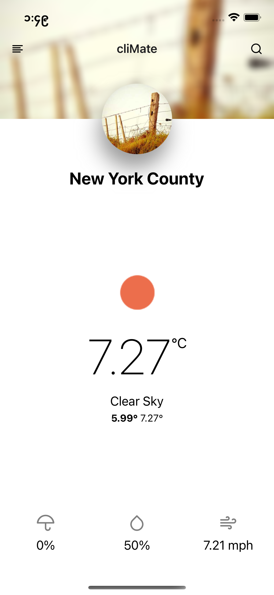
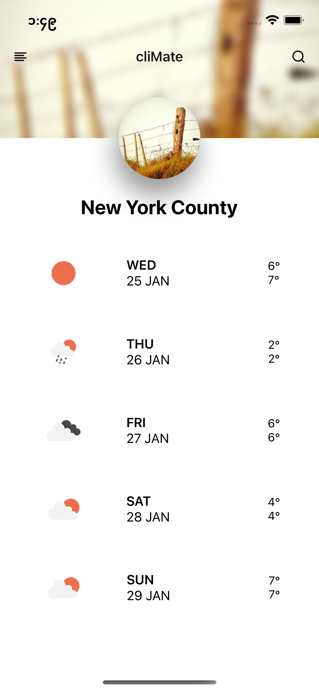
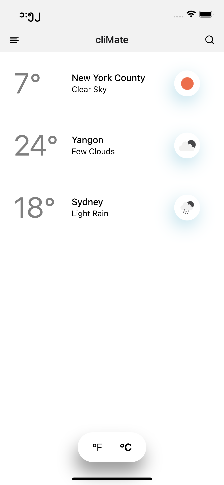
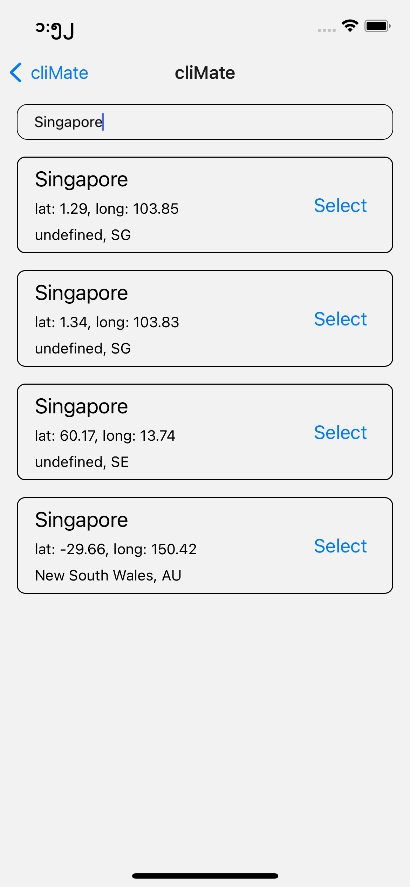

# Project Info

- React native implement of the [Minimal Weather App](https://dribbble.com/shots/5470987-cliMate-Minimal-Weather-app/attachments/10886922?mode=media)

## How to run

- Clone the repo
- Run `yarn install` or `npm install`
- Go inside `ios` folder and run `pod install` for necessary pod files installation
- Run `yarn android` for android or `yarn ios` for ios

## Services

- Weather information are retrieved from [Open Weather Map](https://openweathermap.org/)

## App Structure

The application is structured according to the servies and responsibilities.

Inside the `src` folder, there are following folders.

- `models` - models used across the application. They are used to map the infomation coming from user or API to application format.
- `navigator` - definitions for screen navigation structure based on `react-navigation` library.
- `redux` - state management for application data layer. `redux-saga` is used for handling side-effects.
- `screens` - UI layer that user can interact.
- `services` - third party or in-app services that application rely on
- `utils` - utility functions

## Screenshots

## Improvements

- Tests are considered but not included in current implementation. For better consistency, they should be included.

## Weather Units

- Imperial
  - Temperature - Fahrenheit
- Metric
  - Temperature - Celsius
